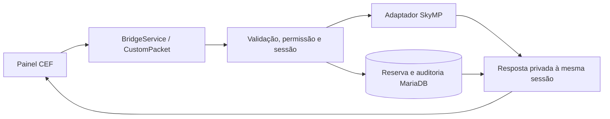

# Implementação e decisões — 20/09/2026

**Atualização de 23/09/2026 (0.1.1):** a ativação e instalação local posteriores a este registro estão documentadas em [INTEGRACAO_INGAME.md](INTEGRACAO_INGAME.md). A proteção `console-guard.cjs`, seu ajuste em `install.cjs` e testes foram incorporados ao repositório do painel. O monorepo de referência passou a usar SQLite para os dados RP, mantendo a persistência nativa do mundo em arquivos. A infraestrutura SQLite não faz parte deste pacote. A homologação ingame continua pendente.

Validação desta atualização: 41 testes unitários aprovados (33 existentes e 8 da proteção de console); `integrate.cjs --check` contra o monorepo local retornou zero arquivos a atualizar. Os resultados de SQL, navegador e compilação abaixo são históricos da implementação inicial, não uma nova execução nesta atualização documental e de proteção do boot.

## Arquitetura

Saldo, inventário e aposentadoria gravam o efeito persistente e o resultado na mesma transação SQL. Entrega de item no jogo ocorre depois do commit e pode produzir resultado incerto. Não existe transação distribuída entre jogo e banco.

| Código | Responsabilidade |
| --- | --- |
| `gamemode/protocol.cjs` | Esquema fechado, IDs, limites e parâmetros |
| `gamemode/service.cjs` | Autorização, hierarquia, sessões, rate limit e idempotência |
| `gamemode/mysql-store.cjs` | RBAC persistente, transações e auditoria |
| `gamemode/skymp-host.cjs` | API nativa, IDs de rede, inventário e identidade |
| `gamemode/install.cjs` | Configuração, router, aliases e console legado |
| `ui/app.js` / `ui/admin.css` | Interface de produção e transporte CEF |
| `scripts/preview.cjs` / `ui/demo.js` | Demonstração separada |
| `scripts/integrate.cjs` | Integração repetível com backups |
| `scripts/migrate.cjs` | Migração com lock e registro de execução |

Conta/cargo enviados pelo navegador não são aceitos. Conta e personagem vêm da conexão autoritativa. Tokens mudam em reconexão/troca de personagem; pacotes de sessão encerrada são descartados. Respostas sensíveis atrasadas não restauram uma UI fechada.

Limites: 20 pedidos por ator em 10 segundos, JSON de 4096 caracteres. Motivo e parâmetros são revalidados no servidor. A UI usa conteúdo textual, sem interpolar nomes/motivos em HTML.

## Heavy RP e comandos Vanilla

Foi estudado o [admin-service.js, commit f686977](https://github.com/vinicius3232/skymp-heavy-rp/blob/f686977343156a2b188dc1271cabe9b2ae197e6a/skymp/gamemode/admin-service.js). A pesquisa anterior está em `REAVALIACAO_HEAVY_RP.md`; seus testes são distintos dos testes do novo painel.

O adaptador corrige a conversão actorId → userId para kick e reutiliza métodos transacionais do gamemode. Não há executor genérico Vanilla. Teleporte usa `locationalData`; inventário usa `ObjectReference.GetItemCount` e `ObjectReference.AddItem`, com referências tipadas. As assinaturas foram conferidas na referência Papyrus e as implementações nativas consultadas no checkout.

## Meridian UI

Fontes: [mod indicado no Nexus](https://www.nexusmods.com/skyrimspecialedition/mods/190723) e [repositório oficial](https://github.com/heathbrownkeyworks/MeridianUI). Meridian é uma plataforma nativa SKSE/CEF para HTML/CSS/JS, com API e ciclo de vida próprios.

Esta versão aproveita o CEF e o transporte existentes no SkyMP. Meridian exigiria consumidor/adaptador nativo e homologação de foco, renderização e coexistência. Seu uso foi autorizado como opção; não foi necessário adicionar DLL para construir o painel na infraestrutura atual. O transporte está concentrado em `request`, `receive` e `focusGame` para futura adaptação. Não se declara suporte ao Meridian nesta versão.

## Validação

| Verificação | Resultado |
| --- | --- |
| `node --test tests/*.test.cjs` | 33 aprovados |
| `tests/mysql.integration.cjs` | 10 cenários em MariaDB 11.4.13 isolado, porta 34327 |
| `tests/ui.integration.cjs` | 6 cenários em Edge headless via Playwright |
| Build TypeScript/webpack integrado | Aprovado, webpack 5.94.0 |
| 1280×720, 1920×1080 e 2560×1080 | Sem transbordamento horizontal nas áreas verificadas |
| Skyrim com dois clientes | Pendente |

Os testes SQL usam definições reais das tabelas Aetherius e seu `transaction-service` em banco novo. Cobrem migração sem restaurar permissões revogadas, reserva concorrente, saldo absoluto, rollback do ledger, revogação na transação, entrega incerta, falha na auditoria final, privacidade e aposentadoria.

Os testes de navegador cobrem alvo, motivo, clique duplo, auditoria, diálogo, ferramentas desabilitadas, resoluções, descarte de resposta sensível e entrada de produção sem mocks. Capturas em `docs/images` usam dados fictícios.

Para repetir SQL: checkout opcional em `AETHERIUS_SOURCE`, instância MariaDB descartável em `127.0.0.1:34327` e `ADMIN_TEST_DB_PORT=34327`. Esse teste não lê `database.local.json`. Para UI, inicie a prévia, configure `PLAYWRIGHT_MODULE` e, se necessário, `BROWSER_EXECUTABLE`. Não há download automático das ferramentas.

## Limites

As referências orientaram a organização das abas; o visual é próprio e funcional. Banimento persistente, animações, investigação de mundo, edição de cargos, receitas e whitelist não foram implementados no novo painel. A whitelist continua no fluxo existente; estados indisponíveis não executam ações.

No marco original de 20/09/2026, o código estava integrado ao checkout local e o cliente compilado, antes da ativação e instalação. Essas etapas foram realizadas posteriormente no ambiente de referência, conforme o guia atualizado. A configuração distribuída continua desativada. Homologação pendente descrita em `OPERACAO.md`.
