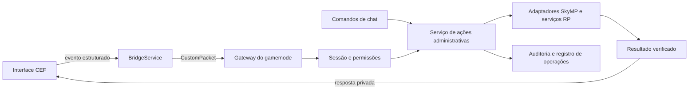

# Introdução do Painel de Administrador ingame

## 1. Objetivo e decisões iniciais

Criar um painel em português para a Staff executar ações por botões dentro do jogo. O servidor decide quem pode abrir, quais informações pode receber e quais operações pode executar. Chat e painel devem compartilhar a mesma implementação administrativa.

Premissas propostas:

- Integrar ao monorepo `Aetherius-RP-Local`, preservando sua UI, HUD e serviços existentes.
- Usar HTML/CSS/JavaScript no CEF já distribuído com o cliente e CommonJS no gamemode. Alterar TypeScript do cliente apenas para atalho, ponte ou foco que a integração exigir.
- Reutilizar os cargos `moderator`, `admin` e `owner` de `staff_roles`, separados de VIP.
- Usar o Heavy RP no commit `f686977343156a2b188dc1271cabe9b2ae197e6a` como base de reaproveitamento: serviço administrativo, adaptador SkyMP, gateway, roteador e testes. Integrar por mudanças pequenas, sem substituir o gamemode Aetherius inteiro. Comparação detalhada em [REAVALIACAO_HEAVY_RP.md](REAVALIACAO_HEAVY_RP.md).
- Implantar primeiro consulta de jogadores, teleporte até jogador, expulsão e histórico. Liberar itens e ouro após validar persistência e economia.
- Manter recursos não homologados indisponíveis, com motivo claro. Existência no código não equivale a funcionamento confirmado no jogo.
- O nome do botão representa a intenção administrativa. Quando necessário, reproduzir o efeito de um comando com uma API do servidor, sem enviar texto arbitrário ao console.

## 2. Experiência da Staff

Abertura proposta por `/admin` e por uma tecla configurável. Ambos são novos recursos. O atalho inicial sugerido é F7, condicionado ao inventário de conflitos; F1, F2 e F6 já têm funções em `BrowserService`. A UI atual é predominantemente de voz e não fornece um chat administrativo completo: a abertura por tecla será necessária para a primeira homologação.

Fluxo:

1. O cliente solicita abertura; o servidor resolve a sessão e consulta o cargo.
2. Sem autorização, responde apenas com acesso negado, sem lista de jogadores ou dados de Staff.
3. Com autorização, envia capacidades e dados iniciais. A interface abre com cursor e foco.
4. A Staff escolhe um jogador, uma ação e seus parâmetros. O alvo permanece visível no formulário e na confirmação.
5. O servidor revalida sessão, permissão e alvo, executa e retorna resultado correlacionado.
6. Escape/Fechar devolve o controle ao jogo. Desconexão e revogação invalidam a tela e os dados recebidos.

| Área | Conteúdo e comportamento |
|---|---|
| Visão geral | Cargo, conexão, quantidade de jogadores e últimas ações do operador |
| Jogadores | Busca por nome visível/identificador, lista paginada, estado da conexão, seleção inequívoca do alvo; não pesquisar nomes reais ocultos para contornar anonimato |
| Detalhes do jogador | Identidade visível segundo as regras RP, identificadores necessários ao atendimento, localização permitida e ações disponíveis |
| Ações | Ir até, expulsar; depois trazer/retornar, entregar item e ajustar ouro, conforme matriz |
| Histórico | Operador, alvo, ação, motivo, horário, resultado e identificador da solicitação; filtros e paginação |
| Ferramentas avançadas | Área futura para operações homologadas de mundo/diagnóstico, restrita por capacidade |

Revelar nome real será uma ação separada, restrita e auditada, baseada em `/revelaridentidade` do Heavy RP. Não incluir esses nomes em payloads, filtros, sugestões de busca ou históricos acessíveis a quem não possui a capacidade correspondente. A revelação é informação administrativa pontual; não altera o conhecimento do personagem nem os nomes exibidos no chat/nametags.

Direção visual: sobreposição escura, contraste alto, detalhes discretos em dourado, tipografia legível e botões com texto. Separar visualmente ações de consulta e ações que alteram jogadores. Adaptar a 1280×720, 1920×1080 e ultrawide sem encobrir a confirmação ou o botão de fechar. Validar no CEF da distribuição, além de navegador comum.

Estados obrigatórios: carregando, sem jogadores, acesso negado, servidor indisponível, alvo desconectado, ação em andamento, concluída, rejeitada e resultado incerto. Clique desabilitado enquanto pendente não substitui prevenção de duplicidade no servidor. Timeout não deve ser mostrado como sucesso nem disparar nova mutação automaticamente.

Confirmação para expulsão, trazer jogador, itens, ouro e operações destrutivas. Mostrar alvo, efeito e motivo; para ouro, saldo observado e valor solicitado. Navegação por teclado, foco visível e mensagens que não dependam apenas de cor.

## 3. Arquitetura proposta



O fluxo existente no Aetherius recebe `cef::ui:event` no cliente, envia `{type, data}` em `CustomPacket` e resolve `actorId` por `mp.getUserActor(userId)` no servidor. A extensão proposta registra exclusivamente o namespace `admin` em `core/ui-event-router.js`.

Proposta de eventos, ainda não implementados: `admin:open`, `admin:players:list`, `admin:action`, `admin:audit:list` e `admin:close`. Reaproveitar o roteador Heavy RP que já valida o envelope e despacha exclusivamente pelo prefixo; o fallback para todos os handlers existe na versão Aetherius, mas já foi retirado da referência pública. Testar os módulos Aetherius que possam depender desse fallback antes de removê-lo.

O Heavy RP atual usa outra entrada: `sendMessage({type,data})` → `makeEventSource('_onUiEvent', ...)` → gateway. Seu `createUiEventGateway` pode ser aproveitado com a entrada `CustomPacket` do Aetherius, mantendo a origem do ator no transporte. Esta é a opção inicial proposta; não instalar simultaneamente os dois encaminhadores para o mesmo evento. Se o experimento M0 escolher migrar para event source, alterar emissor e receptor juntos e desativar a rota anterior. Reutilizar validação, logs sanitizados e limitador do Heavy RP; configurar limites para eventos administrativos, pois o limitador herdado apenas observa por padrão.

Proposta de requisição de ação:

```json
{
  "version": 1,
  "requestId": "uuid-gerado-por-solicitacao",
  "action": "player.teleportTo",
  "target": { "characterId": 123, "sessionVersion": "valor-emitido-pelo-servidor" },
  "params": {},
  "reason": "Atendimento de chamado"
}
```

`characterId` e `sessionVersion` acima são um contrato novo, ilustrativo. O cliente não fornece a identidade ou o cargo do operador. O servidor obtém operador, conta, personagem, ator e sessão pelo transporte autenticado, e resolve novamente o alvo. Os identificadores `userId`, `actorId`, `profileId` e `accountId` não são intercambiáveis.

Resposta proposta: `version`, `requestId`, `status`, `code`, `message` e `data` restrito à operação. Estados: `accepted`, `succeeded`, `rejected`, `failed`, `unknown`. Aceitação significa que a solicitação foi recebida; sucesso exige o critério de conclusão específico da ação.

Priorizar resposta privada por pacote de servidor, com receptor explícito no cliente e sequência/correlação. Avaliar uma propriedade exclusiva do dono como alternativa no primeiro experimento. `browserModal`/`panelData` já demonstram esse padrão, mas uma única propriedade pode sobrescrever respostas concorrentes e seus valores podem persistir. Se utilizada, exigir controle de sequência, reconhecimento, limpeza e descarte de sessões antigas. Não transmitir histórico ou capacidades aos vizinhos.

Criar um catálogo de ações no servidor: identificador, permissão, schema, limites, disponibilidade, confirmação, executor e critério de resultado. A UI recebe uma projeção desse catálogo. Nunca aceitar comandos, JavaScript, SQL ou nomes de funções arbitrários vindos da página.

Os handlers de chat passam a chamar o mesmo serviço e a aguardar seu resultado. Não simular digitação no chat: o dispatcher atual só informa que encontrou o comando, não que o efeito ocorreu.

## 4. Autorização e identidade

| Capacidade proposta | Moderator | Admin | Owner |
|---|---|---|---|
| Abrir painel e listar jogadores | Sim | Sim | Sim |
| Ir até jogador e expulsar | Sim | Sim | Sim |
| Histórico de ações autorizado | Sim | Sim | Sim |
| Revelar identidade e consultar registros sensíveis | Não | Fase futura | Fase futura |
| Entregar itens e ajustar ouro | Não | Sim | Sim |
| Encerrar personagem permanentemente | Não | Fase futura | Fase futura |
| Administrar cargos | Não | Não | Fase futura |
| Banir/desbanir | Não | Fase futura | Fase futura |

O estado atual usa `teleport`, `kick`, `add_item`, `set_gold` e `view_audit` em constante de código. Após a revisão, a arquitetura alvo segue o ADR 005 do Heavy RP: catálogo de permissões e associação cargo → permissão no banco, com seed versionado e autorização por capacidade. Adotar no recorte do painel os nomes `players.teleport`, `players.kick`, `inventory.grant`, `economy.adjust` e `logs.view`, com capacidades explícitas de abertura/leitura. Atualizar os consumidores de chat e painel juntos, com migração e testes; escrever os nomes novos sem essa migração resultaria em negação.

A tabela atual `staff_permissions` referencia a atribuição de uma pessoa, não uma definição de cargo. Não preenchê-la como se já implementasse o modelo novo. A migração deve ser aditiva e preservar concessões; o desenho público de RBAC ainda não está implementado no serviço examinado. Cargos adicionais, múltiplas atribuições e overrides pessoais do desenho completo ficam para evolução própria, sem serem pré-requisito do MVP ingame.

Separar `identity.reveal` e `logs.view.security` de consulta operacional. A permissão de ler histórico não concede acesso automático aos eventos de revelação, gestão de cargos e demais dados sensíveis. Negar por padrão e registrar negações sem incluir o conteúdo protegido.

Reconsultar autorização antes de cada mutação. Invalidar permissões e telas quando o cargo mudar, o personagem trocar ou a conexão encerrar. Em falha na consulta de autorização, negar a mutação. Corrigir o carregamento de cargo para apagar qualquer entrada anterior antes de concluir que não há cargo ou quando ocorrer erro.

O perfil local usa identidade offline escolhida pelo cliente e caminhos de whitelist de laboratório. Isso não satisfaz autenticação de Staff para produção. Antes de disponibilizar o painel fora do laboratório, validar o vínculo autenticado sessão → perfil → conta → personagem; a whitelist Aetherius consultada ainda relaciona `profileId` com `discord_identities.discord_id`, diferente da intenção documentada no Heavy RP mais recente. Não conceder Staff automaticamente aos perfis 1/2. Para testes locais, preparar contas e cargos explícitos em ambiente isolado, distinguindo os fluxos de personagem sintético e persistente.

O painel não requer conceder `consoleCommandsAllowed` à Staff. Proposta: manter `enableConsoleCommandsForAll=false` e não conceder o acesso amplo por ator. Verificar também flags persistidas de atores existentes. A autorização nativa do console é separada das permissões do gamemode e não deve oferecer um caminho alternativo que evite o histórico e a economia do painel.

Validações: tipos estritos; tamanhos de mensagem; inteiros e faixas; alvo conectado; sessão ainda correspondente; motivos limitados e sem HTML; catálogo de itens autorizado; limites por ação e conta. Renderizar textos como texto, não como HTML. Definir política de ações sobre outros membros da Staff antes da liberação: proposta inicial impede afetar cargo igual/superior, exceto operações explicitamente previstas para owner.

## 5. Consistência, economia e auditoria

Registrar tentativa autorizada antes da mutação e resultado após execução: `requestId`, origem (chat/painel), conta operadora, cargo observado, alvo, sessão, parâmetros normalizados, motivo, horário do servidor, estado anterior/posterior quando cabível e erro sanitizado. Registrar também recusas de autorização, com limitação de volume e sem vazar dados do alvo.

Usar `audit_logs` existente como base e uma migração incremental para correlação/estado ou tabela de operações se necessário. Não recriar schema nem reinicializar banco. Para itens e ouro, acoplar registro econômico e idempotência à mesma transação disponível no domínio. Duplicatas da mesma solicitação retornam o resultado anterior; mesmo identificador com conteúdo diferente é rejeitado.

Jogo e SQL não formam uma transação única: registrar execução pendente e reconciliar falhas parciais. Após reinício, uma ação incerta não é repetida cegamente. Para teleporte, comparar localização autoritativa; para kick, observar encerramento da sessão correta; para ouro/itens, verificar ledger e reconciliação com o estado do jogo. Definir tolerância de posição no experimento.

`auditLog` atual captura falha de gravação e segue adiante. O novo fluxo precisa impedir o início de mutações se não conseguir registrar a intenção, e preservar operações pendentes para recuperar falhas após o efeito. Não prometer rollback universal: teleporte pode ter retorno salvo; item já consumido e jogador expulso exigem tratamento específico.

`setGold` atual lê o saldo e depois aplica um delta: o resultado pode divergir do valor solicitado sob concorrência. Exigir operação absoluta atômica ou verificação de versão com rejeição explícita; não exibir “saldo definido” sem garantir essa semântica. Itens devem usar o serviço transacional RP, evitando a rota Vanilla que não demonstra atualização do ledger SQL.

## 6. Organização da implementação futura

Todo planejamento e, posteriormente, os testes/protótipos próprios ficam em `Painel_Admin_Aetherius`. Estrutura sugerida, ainda não criada:

```text
Painel_Admin_Aetherius/
  ui/                 componentes e estilos do painel
  gamemode/           catálogo, serviço e adaptadores administrativos
  contracts/          schemas de eventos e resultados
  tests/              testes de contrato e domínio
  integration/        patches mínimos e manifesto de integração
  evidence/           relatórios de homologação sem credenciais
```

Manter uma única fonte de cada componente. O mecanismo de integração deve empacotar os arquivos desta pasta na árvore de build/staging esperada pelo Aetherius e aplicar alterações mínimas nos pontos de entrada. Não criar um segundo gamemode completo nem editar `runtime` ou `dist` como fonte. Definir esse mecanismo no primeiro marco para evitar arquivos editados em dois lugares.

Pontos esperados de integração em `Aetherius-RP-Local`: `aetherius/ui/index.html`, `aetherius/gamemode/phase0-basic.js`, `commands.js`, `admin-service.js`, `core/ui-event-router.js`, gateway/limitador/adaptador aproveitados do Heavy RP, migrações de RBAC, TypeScript da ponte/foco e `scripts/Prepare-Runtime.ps1`. Existem alterações locais no monorepo; preservar e identificar o diff da implementação separado delas. Antes de adaptar código externo, registrar origem, revisão e licença; esta entrega continua contendo apenas documentação própria.

## 7. Etapas e entregáveis

Estimativa inicial para uma pessoa, em dias úteis de desenvolvimento; não representa prazo contratado. Depende de dois clientes disponíveis e pode aumentar se a identidade online precisar de implementação própria.

| Marco | Trabalho | Dependência e aceite | Estimativa |
|---|---|---|---|
| M0 — Contratos reais | Inventariar artefatos usados, selecionar uma rota CEF, provar ida/volta; comparar componentes Heavy RP/Aetherius e confirmar identidade, IDs e APIs | Dois clientes recebem respostas privadas e correlacionadas, sem encaminhamento duplicado; plano de reaproveitamento | 2–3 dias |
| M1 — Serviço autorizado | Adaptar serviço/adaptador/gateway Heavy RP; migrar o recorte RBAC; schemas, revogação, auditoria, deduplicação, retornos e integração do chat | Pacote forjado, replay e usuário comum não alteram estado; kick convertido, sessão revalidada, sem bypass pelo chat | 4–6 dias |
| M2 — Interface | Tela, jogadores, busca, histórico, foco, atalho e estados de resposta | UI utilizável nas resoluções previstas, Escape restaura controle e dados não vazam | 3–4 dias |
| M3 — MVP operacional | Ir até, expulsar, histórico e integração real | Efeitos observados em dois clientes e no servidor, inclusive slot de rede zero | 2–3 dias |
| M4 — Itens e economia | Catálogo permitido, entregas, saldo atômico, reconciliação | Sem duplicação ou perda sob concorrência, reconexão e reinício | 3–5 dias |
| M5 — Homologação e entrega | Regressão, falhas de rede/banco, guia da Staff e implantação reversível | Matriz de aceite com evidências e capacidades liberadas individualmente | 2–3 dias |

Total estimado revisado: 16–24 dias úteis para a primeira versão com itens e economia, incluindo a migração mínima do RBAC. O reaproveitamento reduz trabalho de criação, mas não elimina integração ou homologação. Um MVP de consulta/teleporte/kick pode ser entregue após M3 e uma rodada proporcional dos testes de M5. O serviço de identidade de produção é um bloqueio de publicação, mesmo que a interface esteja concluída.

Trazer/retornar, banimentos, animações, cura/reviver, revelação de identidade, ferramentas de mundo e gestão de cargos formam etapas posteriores. Reaproveitar os serviços existentes do Heavy RP onde houver suporte; cada ação deve passar pela matriz de viabilidade antes de receber um botão operacional.

## 8. Plano de verificação e implantação

| Grupo | Cenários de aceite |
|---|---|
| Acesso | Sem cargo, VIP sem cargo, cargo revogado com painel aberto, banco indisponível, operador desconectado e ator reutilizado |
| Protocolo | Evento desconhecido, payload malformado, alvo adulterado, sessão antiga, excesso de mensagens, duplicação concorrente, respostas fora de ordem |
| Jogadores | Busca/paginação; dados só para Staff; mudança de nome; desconexão durante confirmação; primeiro jogador com `userId=0` |
| Teleporte | Mesma célula e células distintas; posição inválida; alvo desconectado; divergência entre operador, observador e servidor |
| Expulsão | `actorId` convertido ao `userId` atual; sessão revalidada imediatamente antes da desconexão; nenhum terceiro afetado |
| Economia | Quantidade negativa/fracionária/excessiva; item inexistente; resolver indisponível; duas alterações simultâneas; repetição após reinício |
| Auditoria | Tentativa, autorização e resultado correlacionados; falha antes/depois da mutação; histórico restrito e textos escapados |
| Identidade | Moderador não recebe nome real protegido via lista, busca, detalhes ou histórico; revelação exige permissão e auditoria efetiva |
| Reaproveitamento | Suítes herdadas continuam passando; RBAC migrado preserva direitos previstos; uma mensagem CEF produz no máximo uma execução |
| Interface | Atalho, Escape, inventário/mapa/chat, cursor, HUD de voz, queda de conexão, recarga da UI e feedback de erro |
| Persistência | Reentrada/reinício não duplicam itens, saldo ou ações pendentes; capacidades antigas não reaparecem |

Criar testes automatizados para domínio/protocolo e integração com o banco dedicado. Mocks não comprovam disponibilidade da API nativa. Homologar efeitos de jogo com dois clientes e registrar versão/hash dos bundles, ação, resultado esperado, observado e evidência.

Implantar com flag proposta `ENABLE_ADMIN_PANEL`, inicialmente desabilitada, e capacidades liberadas separadamente. Usar backup dos arquivos afetados e migrações compatíveis; empacotar pelo fluxo do projeto. Em falha, desabilitar o painel e restaurar somente os artefatos alterados. Preservar auditoria e dados; não restaurar banco inteiro por padrão. Os comandos de chat devem continuar sujeitos às mesmas correções e permissões.

Definição de pronto: somente Staff autenticada recebe dados e executa ações; nenhum caminho de chat/console contorna as regras; cada botão liberado tem efeito validado, resultado verificável, registro correlacionado e documentação operacional. Resultado inconclusivo mantém a capacidade desabilitada.
