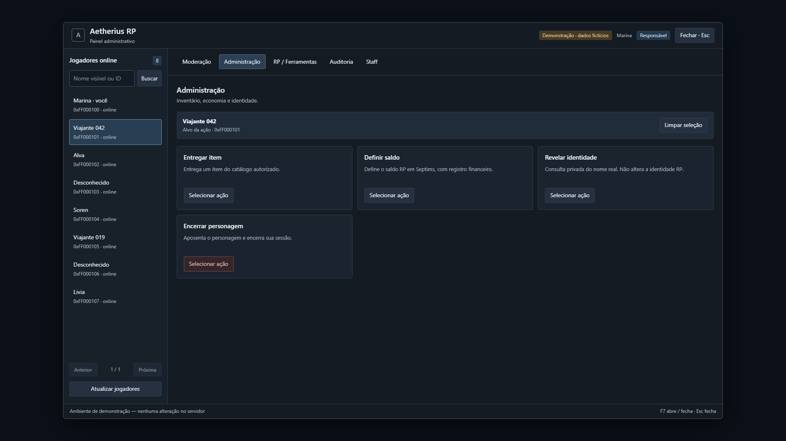

# Painel de Administrador Aetherius

Versão 0.1.1 — 23/09/2026. Interface e serviço implementados; integração, ativação do backend e instalação do cliente realizadas no ambiente local de referência. Homologação dentro do Skyrim pendente. Repositório público; configurações privadas e dados de jogadores não são distribuídos.

Para implementar no seu ambiente: [guia de integração ingame](INTEGRACAO_INGAME.md) e [prompt pronto para o Codex](PROMPT_INSTALACAO.md). O guia usa os componentes já presentes no diretório e distingue instalação MariaDB, servidor Aetherius com SQLite e persistência nativa do mundo.



Painel compacto, com títulos de 15–19 px, texto de 14 px e apoio de 12–13 px. Inclui jogadores pesquisáveis, seleção de alvo, justificativa, confirmação e auditoria paginada.

| Recurso | Implementação |
| --- | --- |
| Ir até / trazer jogador | Localização autoritativa, incluindo célula/mundo |
| Expulsar da sessão | Converte ator em usuário de rede; aceita slot zero |
| Definir saldo RP | Transação SQL e ledger financeiro |
| Entregar item | Catálogo autorizado, ledger e conferência no servidor |
| Revelar identidade | Consulta privada e auditoria sensível |
| Encerrar personagem | Aposentadoria persistente e desconexão |
| Auditoria | Ação, resultado, personagem/solicitação, paginação e motivo |
| Banimento, animações, investigação, cargos e whitelist | Indisponíveis nesta versão |

O módulo vem **desativado**. Após ativação, o exemplo libera somente teleporte e expulsão; demais ações exigem configuração explícita. Não existe executor de console arbitrário.

## Executar

Requer Node.js 22 ou superior; não é necessário instalar dependências npm próprias.

```powershell
node scripts/preview.cjs
npm test
npm run integrate:check
npm run integrate
npm run package
```

A prévia fica em `http://127.0.0.1:4177/demo.html`, com dados fictícios e serviço em memória, sem acesso ao jogo/banco. A entrada de produção não carrega mocks.

O destino padrão é `../Aetherius-RP-Local`. Outro destino: `node scripts/integrate.cjs --apply --target=CAMINHO`. Arquivos anteriores ficam em `artifacts/integration/`.

Na implementação inicial foram aprovados **33 testes unitários, 10 cenários MariaDB e 6 cenários de navegador**, além do build TypeScript do cliente. A versão 0.1.1 inclui também os testes da proteção de console trazida da instalação local. Consulte [operação e instalação](OPERACAO.md) e [decisões e validação](IMPLEMENTACAO.md).

O [Meridian UI](https://github.com/heathbrownkeyworks/MeridianUI) foi avaliado como plataforma nativa SKSE/CEF. Esta versão aproveita o CEF existente do SkyMP; não instala Meridian nem declara compatibilidade ingame com ele.

## Estudos anteriores

Objetivo: oferecer à Staff autorizada uma interface dentro do Skyrim para consultar jogadores e executar ações administrativas, com permissão validada pelo servidor e registro de auditoria.

Documentos:

1. [Plano de implementação](PLANEJAMENTO.md): interface, arquitetura, acesso, etapas e critérios de aceite.
2. [Matriz de comandos](MATRIZ_COMANDOS.md): relação entre botões, console Vanilla, comandos de chat, suporte encontrado e restrições.
3. [Pesquisa e evidências](PESQUISA_TECNICA.md): documentação consultada, fontes locais e lacunas encontradas.
4. [Reavaliação do Heavy RP](REAVALIACAO_HEAVY_RP.md): comparação direta com a `main` pública, componentes a reutilizar e testes executados.

A base de integração proposta é `../Aetherius-RP-Local`, que contém cliente, servidor, gamemode e UI próprios. Os checkouts `vendor/heavy-rp` e `upstream/skymp` são referências, não destinos de implantação deste painel.

**Revisão de 20/09/2026:** o [Heavy RP de vinicius3232](https://github.com/vinicius3232/skymp-heavy-rp/blob/f686977343156a2b188dc1271cabe9b2ae197e6a/skymp/gamemode/admin-service.js) passa a ser a base explícita de reaproveitamento dos serviços administrativos. A `main` consultada coincide com o pin local, mas o Aetherius integrado não contém todas as mesmas correções. O plano foi ajustado para aproveitar o adaptador de kick, gateway validado, roteamento por prefixo, permissões de identidade e desenho de RBAC. Foram executados 110 testes existentes desse recorte, todos aprovados; isso não substitui a homologação ingame.

**Conclusão de viabilidade:** há uma ponte CEF ↔ cliente ↔ servidor aproveitável e serviços administrativos existentes. O painel é viável como extensão do gamemode, mas não como executor irrestrito de qualquer comando Vanilla. Cada ação precisa de um adaptador autorizado, validação dos efeitos no servidor e homologação com dois clientes.

Os documentos de planejamento registram a pesquisa anterior. O estado da instalação de referência e o caminho para reproduzi-la estão em `INTEGRACAO_INGAME.md`; decisões e validações anteriores permanecem em `IMPLEMENTACAO.md`. A configuração distribuída continua desativada por padrão e cada instalação precisa de ativação e validação próprias.
